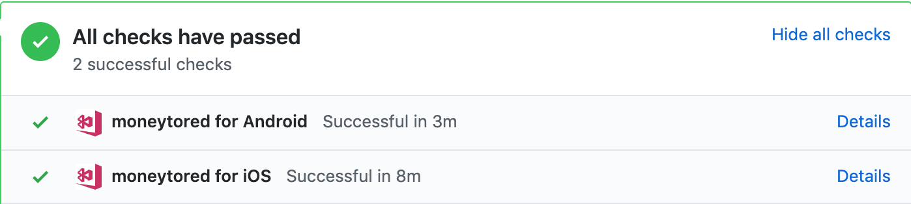

# Deployment

Typically, each native OS and platform has its own build tools, testing tools, and deployment tools. This often implies that you need separate `Continuous Integration` (CI) and `Continuous Delivery` (CD) pipelines for each platform you are working on, thereby duplicating or triplicating your efforts.

[Microsoft’s Visual Studio App Center](https://docs.microsoft.com/en-us/appcenter/) is one of the best ways to deal with the fragmentation of the mobile development landscape: it seamlessly centralises all your Continuous Integration and Continuous Delivery needs in a single place, supporting any platform and framework you may need, including iOS, Android, Windows, macOS, Xamarin, and React Native.

## Build

The App Center Build service helps you build the mobile apps you and your team are working on, using a secure infrastructure. Forget about configuring build servers locally, complicated configurations and code that builds on a co-worker's machine but not yours.

To get started, you, or a member of your team, logs into App Center and opens an app definition. In the App's Build settings, connect to a source control system, select the repository where the app is located at and then simply set up the desired branch to be built.

App Center supports building apps in Git repositories hosted on:

1. Azure DevOps (formerly Visual Studio Team Services or VSTS)
2. Bitbucket
3. GitHub

## Continous Integration

We follow `Github flow` which only means that `master` branch is always deployable. We integrate CI(Continous Integration) and CD(Continous Deployment) to make our lives easier with deployment. Once you push something to our repo, this will trigger the CI we configure on `Appcenter`.

Once `Pull Request` is made we need to make sure that all required checks are pass before we can merge it to our master branch.

Once we merge the `Pull request` to master `Appcenter` will trigger a new release under the group of `Testers` (`this is configurable under build`). The group `Testers` are created under `Appcenter` distribution. You can add more testers to download your beta-application and test it. Under this `Testers` distribution you will also see here your latest releases.

## Beta Testing

Many businesses invest in apps but oftentimes, they hit the audience straight away without going through rigorous beta testing. That’s a big mistake that can, luckily, be avoided with proper planning.

Beta testing is an important part of the app launch process. After developers test their app (that’s a rigorous testing process called alpha testing), they push it forward to real users to test it. At this point, they have the opportunity to get big flaws resolved before making the app available for the wider audience.

### Android

More info can be found [here](https://docs.microsoft.com/en-us/appcenter/distribution/testers/testing-android).

#### Using the App Center Android App

To get started using our native app, simply download it from the Google Play Store or by searching for **"HockeyApp"**.

This app allows you to manage all of your apps and their releases within the app, rather than navigating to our install portal.

After logging in, you will be presented with list of all the apps you've been invited to test. By selecting any of the apps you can review the release history and download the selected app by clicking the **blue install button**. Clicking this will initiate the installation process on your phone.

### IOS

It's best to read the details [here](https://docs.microsoft.com/en-us/appcenter/distribution/testers/testing-ios) so you can add your device for beta-testing
